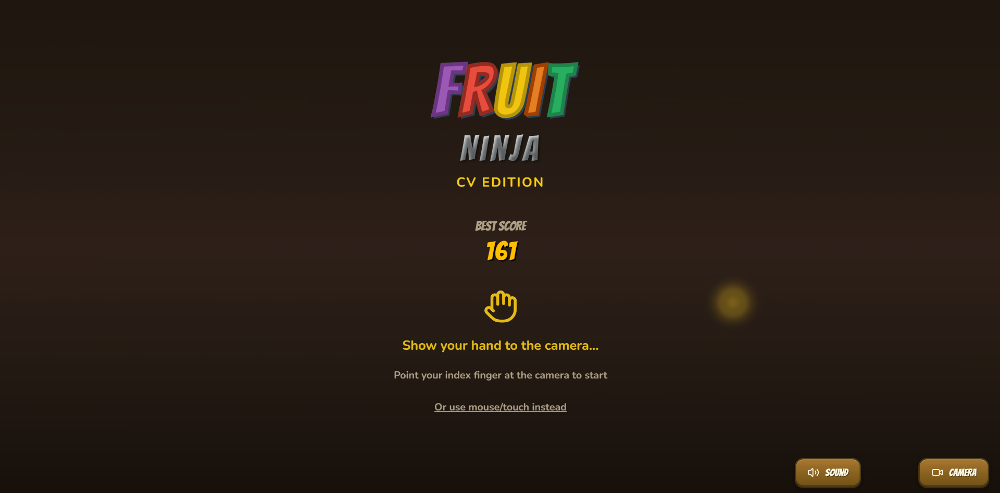
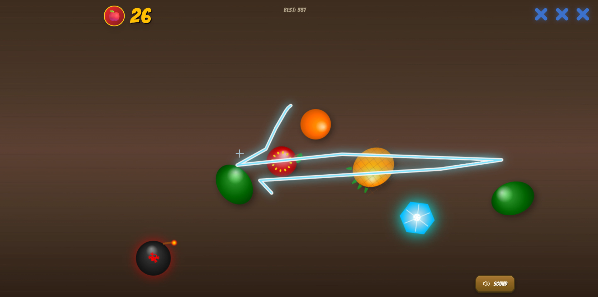
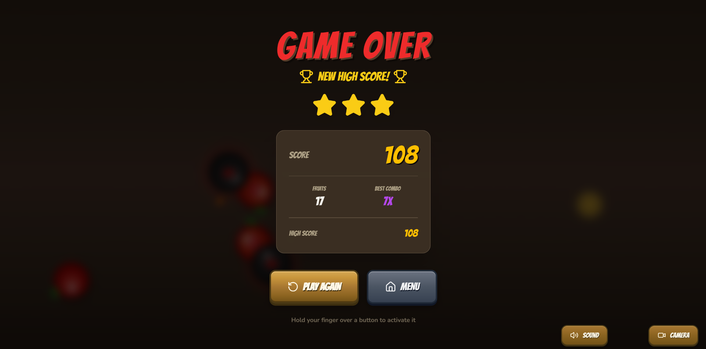

# Fruit Ninja CV

**[🎮 Play Now](https://fruit-ninja-cv.vercel.app/)**

A browser-based Fruit Ninja clone with real-time hand tracking controls. Use your finger to slice fruits via webcam - no installation required!

## Screenshots







## Features

- **Real-time hand tracking** - Control the game with your index finger via webcam
- **Classic gameplay** - Slice fruits, avoid bombs, chain combos
- **Combo system** - Chain slices for multiplier bonuses (up to 8x)
- **High scores** - Persistent leaderboard stored locally
- **Fallback controls** - Mouse/touch support if camera unavailable

## How to Play

1. Allow camera access when prompted
2. Hold your index finger up to the camera
3. Swipe across fruits to slice them
4. Avoid the bombs - hitting one ends the game!
5. Chain quick slices for combo bonuses

## Tech Stack

- React 18 + TypeScript
- MediaPipe Hands for computer vision
- HTML5 Canvas for rendering
- Web Audio API for sound effects
- Tailwind CSS for styling

## Development

```bash
# Install dependencies
npm install

# Start development server
npm run dev

# Build for production
npm run build
```

## Deployment

This is a static web application. Deploy to any static hosting:

```bash
# Build the project
npm run build

# Deploy the 'dist' folder to Vercel, Netlify, or GitHub Pages
```

### Vercel (Recommended)

1. Push code to GitHub
2. Import repository in Vercel dashboard
3. Deploy (auto-detected as Vite project)

## Controls

| Mode          | Action                                       |
| ------------- | -------------------------------------------- |
| Hand Tracking | Point index finger at camera, swipe to slice |
| Mouse         | Click and drag to slice                      |
| Touch         | Tap and swipe to slice                       |

## Game Mechanics

- **Lives**: 3 (lose one when a fruit falls off-screen)
- **Bombs**: Instant game over if sliced
- **Combos**: Slice multiple fruits within 800ms for bonus points
- **Waves**: Difficulty increases as you progress

## Browser Support

- Chrome (recommended)
- Edge
- Firefox
- Safari (limited hand tracking support)

## License

MIT License - feel free to use and modify.
